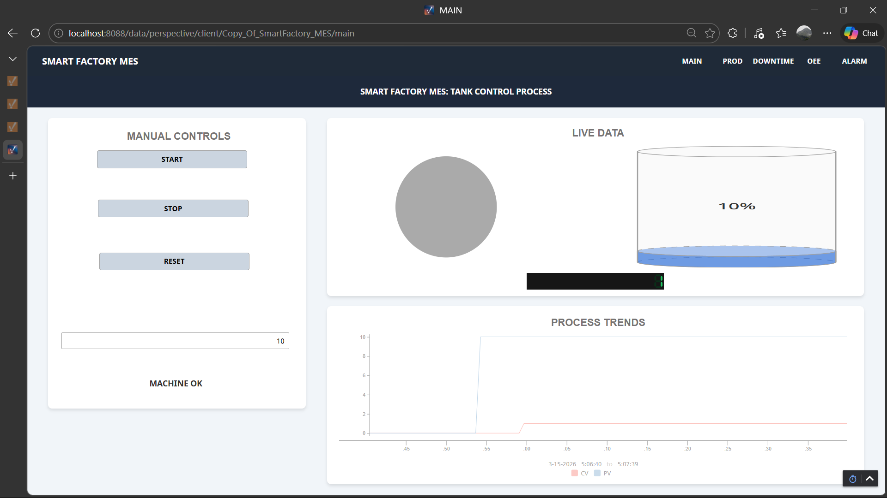
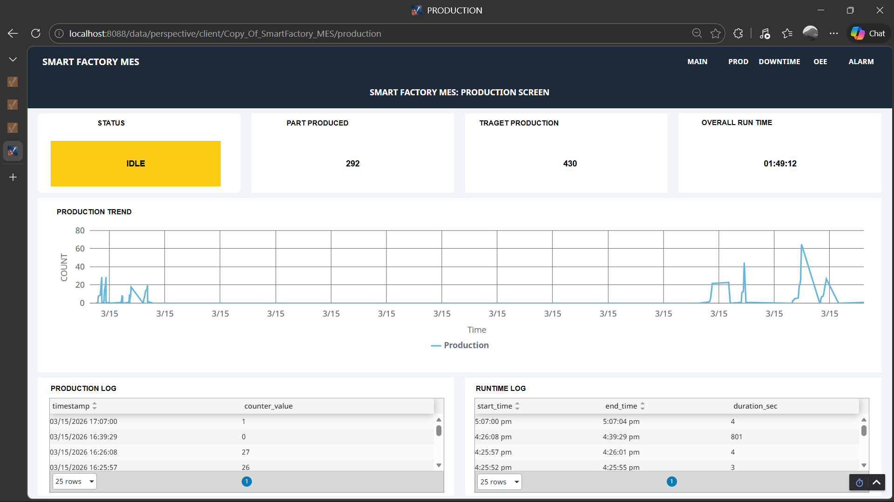
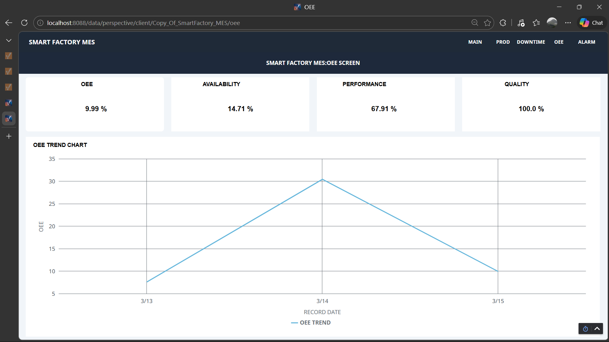
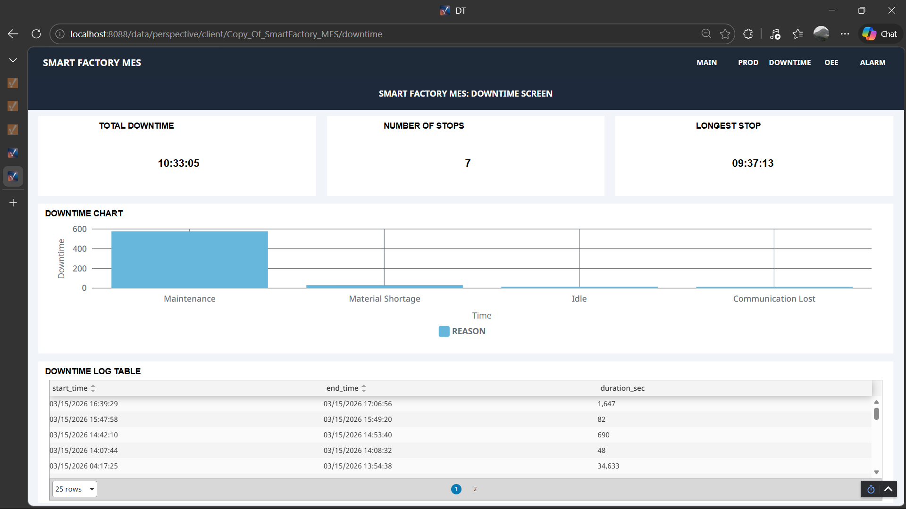
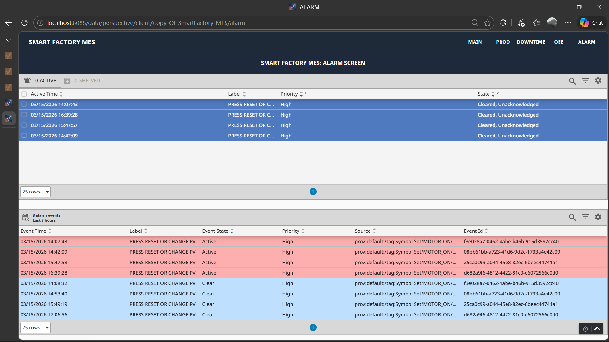
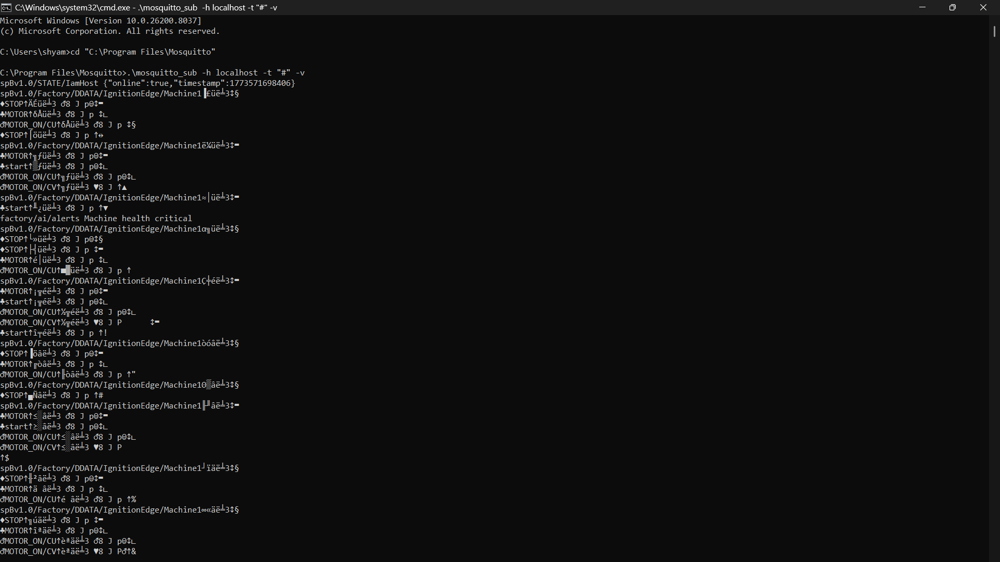
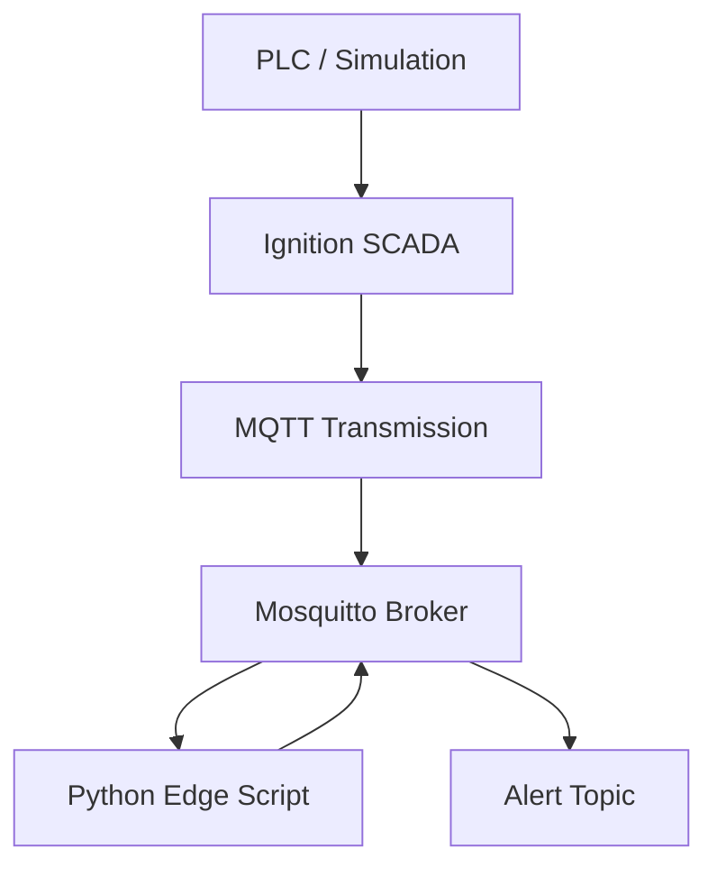

# 🌐 Industrial SCADA System with MQTT & Edge AI (Ignition + Python)


---

## 📌 Project Overview

This project demonstrates a basic industrial **SCADA + IIoT architecture** where machine data is generated in a PLC simulation, visualized in SCADA, and transmitted over MQTT for processing in a Python-based edge application.

The system is deployed across two separate machines to replicate a real industrial setup:

- One system acts as the **control/PLC layer**
- Another system runs **SCADA, MQTT broker, and edge analytics**

The Python service subscribes to machine data, performs anomaly detection, and publishes alerts.

---

## 🏗 System Architecture

| Machine | Role | Software |
|--------|------|---------|
| **PC 1 (Control System)** | PLC Simulation | CODESYS / Simulation |
| **PC 2 (SCADA + Edge)** | SCADA + MQTT + AI | Ignition SCADA + Mosquitto + Python |

---

## 🔁 Data Flow

`PLC / Simulation` → `Ignition SCADA` → `MQTT` → `Mosquitto Broker` → `Python`

`Python` → `MQTT Alerts` → `SCADA / Subscribers`

---

## 🖥 Screenshots

### 1. SCADA Dashboard


### 2. Production Monitoring


### 3. OEE Monitoring


### 4. Downtime Monitoring


### 5. Alarm Screen


### 6. AI Alerts


---

## 🚀 Features

### SCADA Monitoring
- Real-time machine status visualization  
- Production count tracking  
- OEE calculation (basic)  
- Alarm display  

### MQTT Communication
- SCADA publishes machine data  
- Python subscribes to topics  
- Alerts published back via MQTT  

### Edge AI Processing
- Detects anomalies in:
  - Cycle time  
  - Machine behavior  
- Uses:
  - Threshold logic  
  - IsolationForest (basic ML)  

### Industrial Setup
- Two-machine architecture  
- LAN-based communication  
- MQTT broker (Mosquitto)  
- Local edge processing  

---

## ⚙️ Requirements

### SCADA Machine (PC 2)
- Ignition SCADA  
- MQTT Transmission Module  
- MQTT Engine Module  
- Mosquitto MQTT Broker  

---

### PLC / Simulation Machine (PC 1)
- CODESYS (or simulation environment)

---

### Python Edge

Install dependencies:

```bash
pip install paho-mqtt pandas numpy scikit-learn
```
## 🧱 Logical System Architecture


